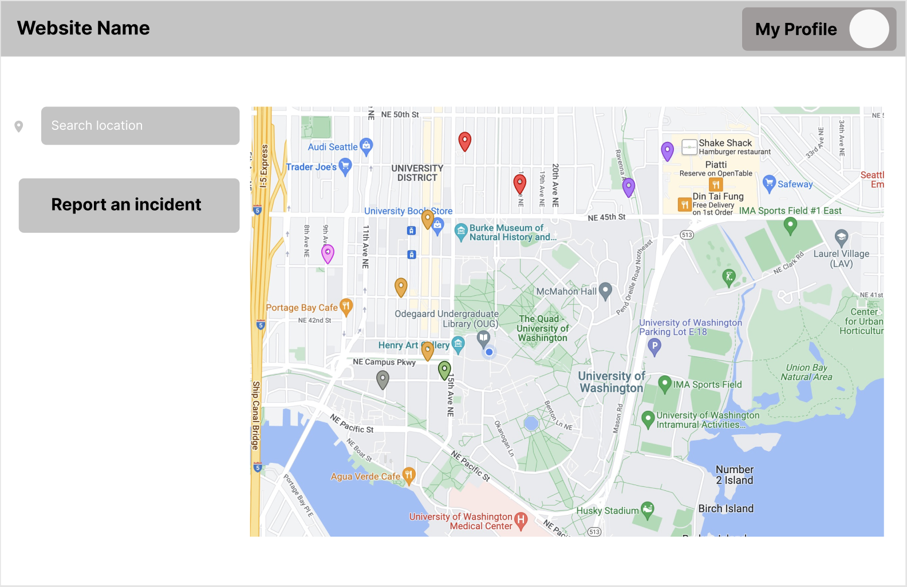
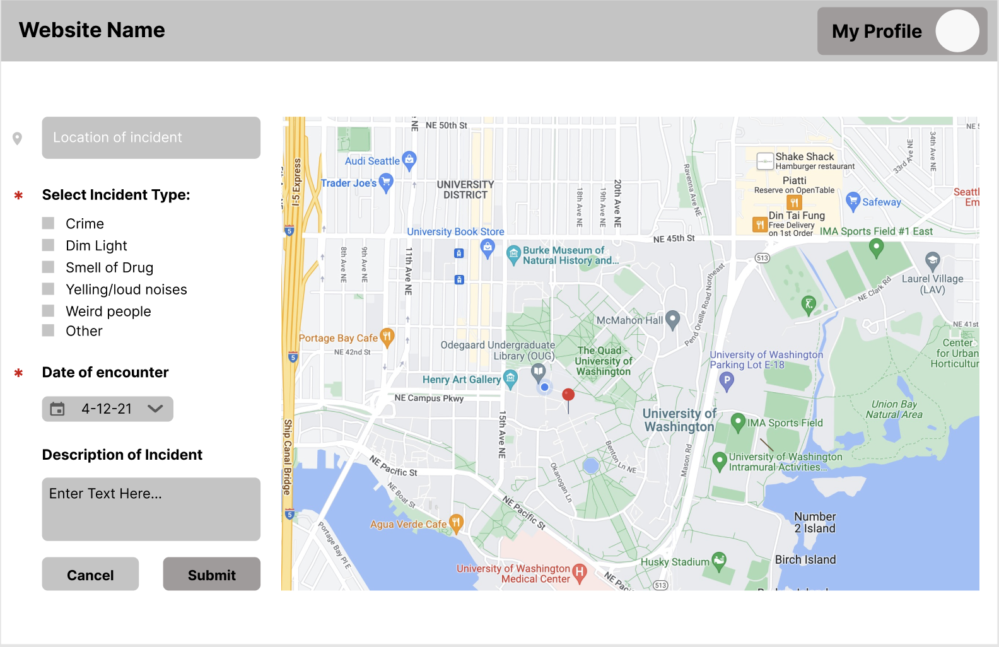
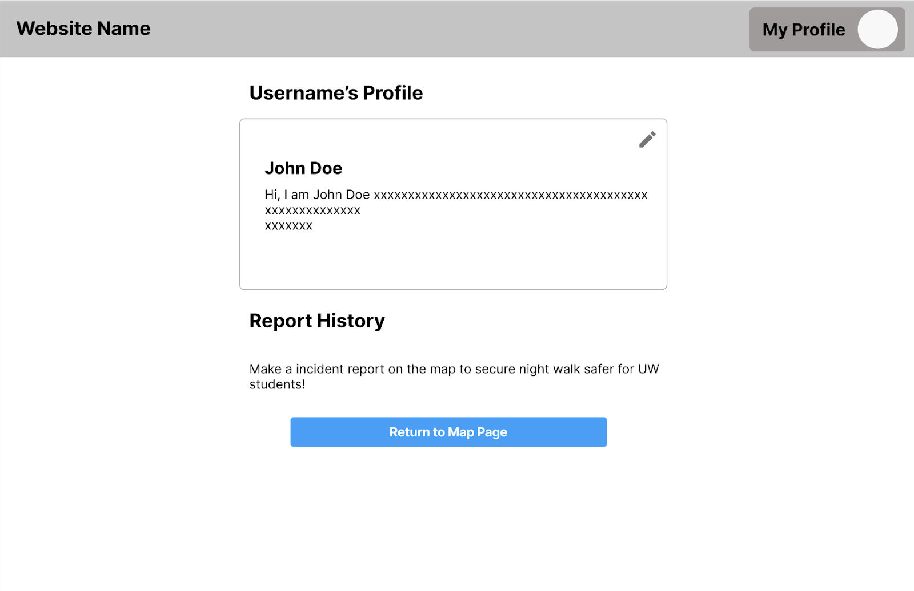
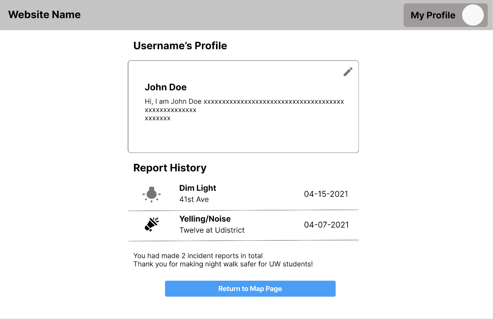
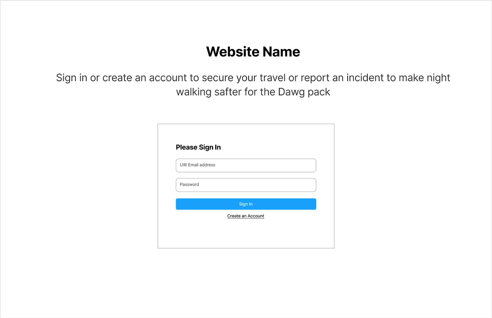

# Test Plan
## Types of testing
This application will use manual acceptance testing. Through the manual testing, we would see if the application satisfies the expected performance requirements and also see how our solution is working from a user’s perspective.
 
## Process
All feature work will be done on feature branches. After development is complete, the developers will open a Pull Request. There will be multiple code reviews on the Pull Requests developers make after they finish their parts. Merging of a Pull Request will trigger a Github Action for unit tests (stretch). If the Action succeeds, a deploy to Firebase will be triggered.  
It is the developers’ responsibility to ensure all parts of the merging and deployment process complete successfully for their Pull Requests. When the process completes, the developers alert the product designer that the feature has been deployed.  
After being alerted, the product designer will manually test the deploy. They will run manual performance testing using Web Page Test– and manual acceptance testing using the script below on at least one of the supported OS/browser combinations.  
Each thursday during development, the project manager will run the acceptance testing script on all supported OS/browser combinations.  
The test will be tested through zoom or in person by UW students living on/off campus near UW area by April 27th for the Hi-fi design and the implemented and published app will be tested by week 8. 
 
## Code
We will record the screen including the voice under permission. Then as a team, we will discuss and look back to see whenever a bug is reported during our weekly meetings. If the subject does not allow, we will take notes throughout the testing.  
 
If there is a bug, it will be assigned to the developer/designer who worked on that specific feature. If they cannot figure it out, we will talk about who can fix it. We will also bring up issues during our weekly meetings.  

## Manual Acceptance Testing Script
Hello, thank you for taking the time to test out our application. Our application aims to provide a safer and more comfortable experience for students walking in the University District. Because of the heightened security risks at night time, our application works to help students report suspicious activities for others. This interview will be anonymous – your name will not be revealed to anyone. If it is okay, can we record this interview?  

Yes - Great, and again we will not show this to anyone and this recording will be deleted after this project.  

No - That is okay, we will be writing down notes throughout this meeting and it will be deleted after.  

The application should contain user authentication. The map feature that allows user to view the history of incident report on the map is available without authentication. When user is logged in, they can use the report incident feature and view their report history in their profile page. The test would be run against the code in the production environment on the supported OS/brower combinations. Custom data for the incident report of the user and user entered information in the sign up form is collected in the testing process.

### Sign in
Click the sign in button on the top right corner of the home (map) page. Expect to be redirected to the sign in page. 

Expect to see the name of our application, intro text (“Sign in or create an account to secure your travel or report an incident to make night walking safer for the Dawg pack”), and a sign in form.  
- Make valid entries in the sign in form and click the sign in button. Expected to be redirected to the home page.
- Make invalid entries in the sign in form and click the sign in button. Expected to see error messages appear in red.
- Click the create an account hyperlink to be redirected to the create account page

### Create account page
Expected to see text (“Build your profile”) and account creation form. The form should include email address, password, user name, and description. (The email address, password, user name section is required.) 
- Make invalid entries in a random required field and click the submit button. Expected to see error message in red.
- Make valid entries in all required fields and click the submit button. Expect to be redirected to the home page.

### User profile page
Need user authentication to visit. If not signed in, the my profile button on the top right corner of the home page should be replaced with a sign in button. 

While signed in: (profile page 1) 
Expect to see user name, description (if not entered while creating account, leave blank). 
- Click on the pencil icon. Expected to appear in the text entry box for users to enter to change user name and description. Click on the save button. Expect to see updated user name and description. 
Expect to see report history.
- (With no incident report made ) Expected to see text (“Make an incident report on the map to secure night walk safer for UW students!”).
- (With incident report made ) Expected to see report records which include report type, report date and report location. Expect to see text under report record (“You had made # incident reports in total. Thank you for making the night walk safer for UW students!”). (profile page 2)
- Click on the Return to Map Page to be redirected to the home (map) page. (home page 1)

### Home (map) page
Expect to see a map with borders that are 4 mile radius from University of Washington as the center, a search location entry box, and a “report an incident” button. (home page 1)

Click on the incident report pin on the map to see detail information of the report (report type and report date) 

Enter a valid location in the search location entry box and hit enter. Expect to see the map zoom into the entered location. If the location entry is invalid, expect to see an error message (“Please enter valid location”) in red.

Click on the report an incident button. (If not signed in, show a pop-up message of “Please sign in to make a report”). Expected to see incident report form, with entry fields of incident location (text entry), incident type (check box), incident encounter date (drop down menu), and incident description (text entry). Every field except incident description is required. (home page 2)
- Make valid entries for all required fields. Click on the submit button. Expect to see a text message (“Report submitted”)(home page 3). Click on the Return to Map Page button. Expected to be redirected to the home page. (home page 1)
- Make invalid entries for random required field(s). Click on the submit button. Expect to see an error message (“Please select an incident type” or “Please select date of encounter” or “Please enter a valid location” ) in red.
- Click the cancel button. Expected to redirect to the home page. (home page 1)

### Follow up questions to ask the user
- What aspects do you like and dislike about the style and design of the application?
- Would you see yourself using this application? Why or why not?
- How easy do you think you can find the information you need on the application?

## Appendix
  
Home page 1 
 
Home page 2 
 
Home page 3 
 
Profile page 1 
 
Profile page 2 
 
Sign in page 
 
Create an account page 
 
