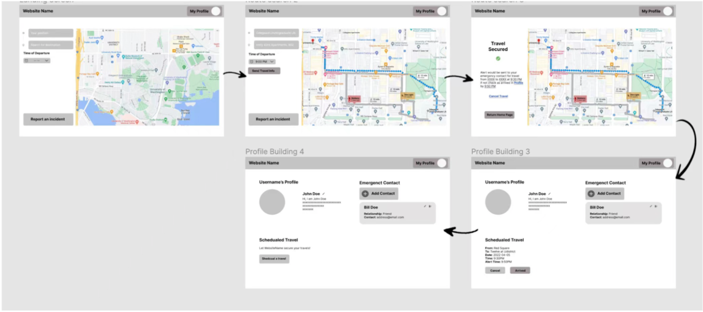

# E-Safety Project Specification

## Problem Statements
As students at the University of Washington start to live off campus due to the pandemic and limited dorm capacity, safety with students walking home at night becomes a crucial issue.
Many off-campus UW students have little access to resources that can help them secure a route home that shows no threat to their safety, especially during night time.

Furthermore, current existing apps focus more on students who live on campus and only pinpoint sites regarding previous crime incidents but do not consider alternative factors that students concern when it comes to choosing a safer route. To investigate further on such topics and learn about our target audience’s struggles, we conducted a survey among university students currently living in the U-District area.   

As the survey shows, 95% of our respondents have experience living off-campus (see Fig.1). Out of these students, about 79% walk home alone (see Fig.2) on a regular basis (3-5 days out of a week and above). It shows that these students largely feel unsafe walking home alone during night time compared to daytime (see Fig.3 & 4), which also supports our assumption that people feel more threatened while walking home at night time. According to the qualitative data we collected through the survey, there are four major conclusions: 1) safety threats of walking home alone are likely to affect a student's class/study schedule 2) students prefer walking home with other people than alone, along with being able to access and share specific information of their walk and the chosen route 3) although past crime incident is still the primary factor of choosing a route, students also concern information regarding other non-crime-related factors that are not universally accessible to them 4) few students have used any technology to facilitate their safety even though they feel threatened by walking home alone on certain occasions.    

Fig.1
     

Fig.2
   

Fig.3
    

Fig.4
    

## Citations
Seattle Crime Online Data Maps http://www.seattle.gov/police/information-and-data/online-crime-maps   
Seattle Crime Rates
https://www.neighborhoodscout.com/wa/seattle/crime (Shows the safest Seattle Area)   
King county Crime maps
https://kingcounty.gov/depts/sheriff/on-line-reporting/city-protect.aspx   
Our survey
https://docs.google.com/forms/d/1kV3ctIrdi9tFim5oL7-bxpqIS1ONmjtRInHFHgz17QE/edit?usp=sharing   

## Solution
We envision a web map application that helps UW students identify possible dangerous routes and sites ahead of any potential crimes or factors that people may want to avoid. The data used for these sites comes from user reports and also official announcements like UW Alerts. A secure travel feature would also be included for students to schedule secured walks. According to the departure time and the estimated transportation time，if the user does not log in the website and click arrive with the time frame, an alert would be sent to the user’s entered emergency contact.

### Landing Page           
 
This is the landing screen of our website. Our website contains two main features: secured ride and incident report. Users can also enter their location and their desired destination to simply search for the desired route. 
 
 
If time of departure is not entered, the map would only show locations of reported incidences near possible routes for the user.

### Secure ride    
 
 
If the user entered a start location, a destination, and also selected an departure time from the drop down menu, the secure ride feature would be activated. The user can click on the “Send Travel Info '' button to secure the travel. 
 
 
A success message would appear to indicate the activation of the secure travel.
The user can click on the blue underlined “Cancel Travel” to link to the user profile page to cancel the travel.The user can also click on the “Return Home Page” button to return to the landing page. 
 
 
When the user arrives their destination, they can click on the “My Profile” button on the top right corner of the top navigation bar to enter their profile page and click on the “Arrived” button (alert would not be sent to emergency contact). The user can also click on the “Cancel” button to cancel scheduled travel (alert would not be sent to emergency contact). 
 
 
This is the profile page when the “Arrived” or “Cancel” button is clicked or when there is no scheduled travel. The user can click on the “Schedule a travel” button to return to the landing page.

### Report Incident      
   
 
If the user clicked the “Report an Incident '' button on the landing page, the user would be directed to this page.The user can enter a location to notice other users place to avoid when choosing a route.The user would click to select one or more incident type. The user would also click the drop down menu to select the encounter time of the incident. The description column is optional.The user can then click on the “Submit” button to report the incident or click on the “Cancel”button to return to landing page. 
 
 
If the user did not select an incident type or time of encounter when clicking the submit button, an error message would appear in red to notify the user to make a selection. The user can make a valid selection and report by clicking “submit” or click “Cancel” to return to the landing page. 
 
 
If the user made all required selections and hit the submit button, a success message would appear to notify the user that their report has been submitted and stored. The incident they reported would also appear on the map (and visible for other users of the website). The user can click on the “Return Home Page” button to return to the landing page. 

### Login/sign up & user profile setting up
 
 
The user can sign in with their UW email address if they already have an account or click the “create an account” to jump to account setup. 
 
 
The user will enter their information accordingly. The columns with a red * sign next to it are required entries. 
 
 
If the user did not enter valid entries for the required columns, red error messages would appear.

### If have time in the future:
 
   

## Appendix
Link to Figma: https://www.figma.com/file/vitnbWVl9aHfcTMyZR4mRC/INFO-442?node-id=0%3A1
